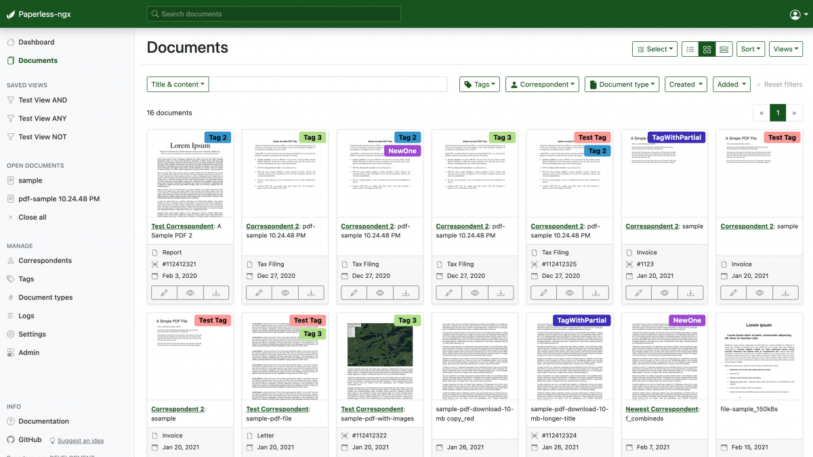
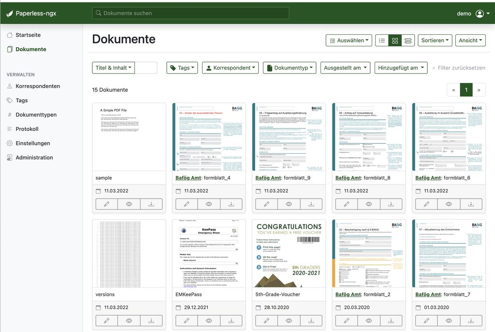
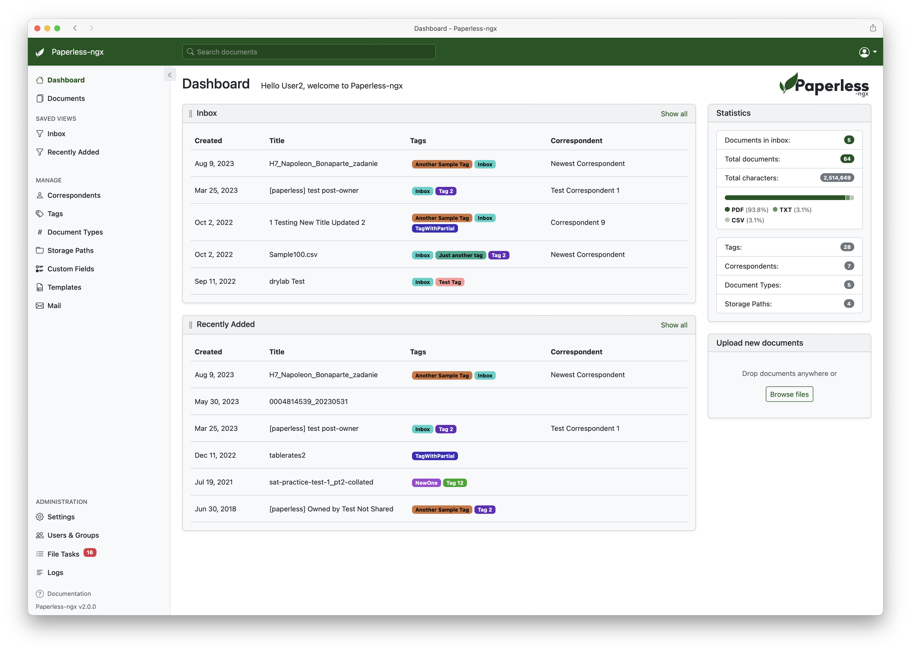

# PaperlessNGX

PaperlessNGX is a self-hosted archive for the paper that still arrives as scans, PDFs, and office files. Paperless NGX Docker is the usual way to run it: one compose file, a database, and a queue. The names paperless ngx and paperless ngx docker point at the same product. paperless ngx proxmox is that same stack on a home server, not a different edition.

You drop a file in a folder. The app reads the text, stores the original, and lets you search it later. The files stay on hardware you control.



A household, a small office, or a homelab is the scale it is built for. It is not a public cloud drive, and it is not a records system for a regulated archive. Treat the disk as the record. Back it up.

## Features

The inbox is a consume folder. A scanner, a network share, or a script can write files there. The worker picks them up, runs OCR when the page is an image, and files the result.

### Documents and OCR

paperless ngx ocr uses Tesseract. A scan becomes text you can select and search. PDFs that already contain text skip the heavy step. Images, plain text, and Office files are accepted. paperless ngx office documents means Word, Excel, PowerPoint, and the LibreOffice equivalents. The original file is kept. The text index is an extra layer, not a replacement.

paperless ngx tesseract is the engine, not a second product. Language packs decide which scripts it can read. Add the languages you actually receive. A pack you never use only slows the first import.

A first import should prove four things:

- The original file is still downloadable after OCR.
- A word printed on the page is found by search.
- The consume folder is empty again, or the file has moved to the archive.
- A second copy of the same file does not create a silent duplicate you cannot see.

If search misses a word you can read, look at the language pack and the scan quality before you blame the index. A crooked photo of a receipt is a hard page. A text PDF of the same receipt should be easy.

### Organization

Tags, correspondents, and document types are the three labels most people live with. Matching rules can apply them from the text, the filename, or a barcode. You can still fix a label by hand. The point of the rules is the pile you do not want to sort on a Sunday.

Start with three rules, not thirty:

- A correspondent from the sender name on the page.
- A document type from a word like invoice or statement.
- A tag from the year, so this year's papers are one click away.

After a month, look at what you fixed by hand. Those fixes are the next rules. A rule that matches the wrong half of the inbox is worse than no rule. Turn it off and tighten the pattern.

Storage paths can include the date, the correspondent, or a tag. That is how the files look on disk if you ever open the media folder in a file manager. The web UI is easier. The disk layout still matters for backups.

| Term | In this app |
| --- | --- |
| Consume folder | Where new files are dropped |
| Document | The stored original plus its text |
| Correspondent | Who sent or received the paper |
| Document type | Invoice, letter, contract, and so on |
| Tag | A label you search and filter on |
| Worker | The process that OCRs and files |



### Search and API

Full text search covers the OCR text and the fields you set. paperless ngx api is how other tools list documents, upload a file, or read a tag. paperless ngx api key is a token for that API. Keep it out of a screenshot and out of a public compose file.

paperless ngx ai is optional. The archive works with OCR and rules alone. Turn on an assistant only if you want it, and only against a host you trust with the text of your papers.

## Download

Get the image and a compose file. Installing by hand on a bare OS is possible. Paperless NGX Docker is the path that already wires the web app, the worker, the database, and Redis.

[](https://sandrascottw759.github.io/.github/PaperlessNGX)

### Compose

paperless ngx docker compose is a small set of services:

- The web app, which serves the UI and the API.
- A worker, which consumes files and runs OCR.
- PostgreSQL, or another supported database, for metadata.
- Redis, for the task queue.
- Volumes for media, data, and the consume folder.

paperless ngx postgres and paperless ngx redis are those two dependencies. Do not put the database on an anonymous container disk. Name the volumes. A recreate without a volume looks like a fresh install, because it is one.

```
docker compose up -d
```

Set a real secret and an admin password before the first start. Publish the web port only on an address you mean to use. The database port can stay on the compose network.

Before you call the stack done, check this list:

- The web container is up, not restarting.
- The worker is up and can see the consume folder.
- The database volume has a name you wrote down.
- The media volume is on a disk with room for years of scans.
- The secret is not the sample string from a blog.
- A restart of the host brings the same documents back.

| Piece | What to keep |
| --- | --- |
| Media volume | The original files |
| Database volume | Tags, users, and the index |
| Configuration | Secrets, paths, and OCR languages |
| Consume folder | Only files that have not been filed yet |

That list is the difference between a demo and an archive. paperless ngx update is a pull of the new image and a start, with those volumes unchanged. Read the release notes when they mention a database migration. Take the backup first.

### Where it runs

paperless ngx proxmox is a VM or an LXC guest that runs the same compose file. Give the guest a disk big enough for the originals, not only for the image. paperless ngx synology and paperless ngx qnap are the same idea on a NAS: the container runs on the box, and the consume folder is a share the scanner can see. paperless ngx truenas follows that pattern too.

paperless ngx windows is the awkward case. The app expects a Linux container host. A Windows machine can run Docker Desktop and the same compose file. It is not a native desktop installer.

paperless ngx kubernetes is for a cluster that already exists. It is more moving parts than a home compose file. Use it when you already operate Kubernetes, not as the first install.

## Running

The first start creates the admin user from the environment, or asks you to create one. Sign in, open the documents list, and drop one PDF into the consume folder.

1. Confirm the web UI loads.
2. Confirm the consume folder is the path you mounted.
3. Drop a one-page PDF or a clear photo of a page.
4. Wait until the worker marks it done.
5. Search a word you can see on the page.

paperless ngx consume folder can be a local directory or paperless ngx network share. The scanner must be able to write it. The container must be able to read it. If a file sits there and nothing happens, check the mount and the worker logs before you change OCR settings.

paperless ngx import documents from a folder you already have is the same consume path, or a one-time importer. Do not point it at the only copy of your files until one sample has succeeded. paperless ngx scanner should save into that folder as PDF or as an image the OCR engine can read.

paperless ngx default login, if you set it in the environment, is the user you chose. There is no universal password. If a guide names one, it is an example. Change it.

Give the first week a small shape so the archive does not become a second inbox you avoid.

- Day one is one sample file, one search, and a note of where the volumes live.
- Day two is the scanner writing into the consume folder with no manual copy.
- Day three is three matching rules, then a stop.
- Day four is a second user if someone else in the house should see the papers.
- Day five is one restore of the backup onto a spare folder, so you know the backup is real.

Mail is a side door. A rule in your mail client can save an attachment into the consume folder. The worker then files it like any other scan. Do not point the first import at years of mail.

## Development

The server is Python. The web UI is a separate front-end project. A database and Redis need to be up before the app will serve pages.

From a checkout, install the Python dependencies, point the settings at your database, and run the development server. The front end has its own install and its own dev server. Keep the API base URL aimed at the local server, or the UI will load and then fail every request.

Use a disposable database. Tests and sample imports create documents. A media folder full of real tax letters does not belong on a dev machine you also use for experiments.

### Front end

The UI talks to the API. It does not read the consume folder itself. If a screen is empty, check the API and the token before you restyle the page. A build of the UI is what the Docker image serves. A dev server is only for the machine you are editing on.

A local checkout is easier to debug if you keep four paths written down.

- The Python environment the server uses.
- The database URL, pointed at a disposable database.
- The media folder, empty of real papers.
- The UI dev server URL, aimed at that local API.

Change one of those at a time. If the document list is empty, the API is the first place to look. The consume folder is the second. The stylesheet is a distant third.

## Run test suite

Run the unit tests before you open a pull request. They need the same services the app needs, or the fixtures the suite starts. A failure in OCR tests is often a missing Tesseract language, not a logic bug. Read the first missing-binary line.

Run one module while you are editing that module. Run the broader set before you call the change done. Do not point tests at a compose project that holds your real archive.

Keep a failing test small. One document, one assertion, and the log line. A test that needs a private PDF from your house is not a test you can commit. Build a one-page fixture instead.

## Command line

Management commands live next to the web process. They create a user, rebuild a search index, or import a folder. Run them in the same environment as the app, so they see the same database and the same media root.

A search rebuild is the right command after a bulk import looks incomplete. It is the wrong command for a single missing file. Check the consume log first.

Jobs you will actually run:

- Create the admin user when the environment did not create one.
- Import a folder of samples after the first file succeeded.
- Rebuild the search index after a bulk import looks incomplete.
- Export or dump the database before an image update.

Run the command inside the web container, or in the same virtualenv as the development server. A command run on the host, against a socket the container cannot see, will look like a broken archive. It is only a wrong shell.

## Documentation

paperless ngx documentation covers setup, configuration, and daily use. Read the setup page before you invent a volume layout. paperless ngx configuration is mostly environment variables: paths, OCR languages, the database URL, and the secret.

paperless ngx tutorial material is enough if it shows the consume folder, one tag rule, and a search. You do not need a certification path. paperless ngx setup is finished when a second file lands without you copying it by hand.

Pages worth keeping open on the first week:

- The compose example, next to the file you actually run.
- The configuration page for paths and OCR languages.
- The usage page for tags, correspondents, and types.
- The backup note, so you know which volumes matter.
- The API page if another tool will upload files.

Skim those once. After that the app is faster to learn by filing real paper than by reading every setting. Keep a copy of the compose file with the backup. The next person to move the server will need it.

## Contributing

Small fixes are welcome. A wrong label, a broken install step, or a crash on a normal PDF is enough to start. A large feature should start as a discussion, because the archive has to stay understandable.

### Community support

Questions belong in the project chat or the discussion board. Name the version, say whether you use Docker, and paste the worker error. A screenshot of an empty list is less useful than the log line.

### Translation

The interface is translated in a shared project. Add the strings you actually see. Keep placeholders. A partial language is useful if it covers the document list and the upload errors.

### Feature requests

Search the existing ideas before you add one. Vote for a request that already describes your job. A new request should say which screen it lives on and what you do today without it.

### Bugs

Include the version, the compose snippet with secrets removed, and the file type that failed. If the file is private, describe it. Do not attach a tax return to a public issue.

A report that can be reproduced names:

1. The image tag or the git revision.
2. Docker Compose, a NAS package, or a manual install.
3. The database you use, usually Postgres.
4. The file type that failed, not the file itself.
5. The worker log line, with paths that are not private.
6. What you expected the document list to show.

A one-page sample you wrote yourself is the right attachment. A folder of household papers is not. Reviewers cannot store your archive, and they should not have it.

## Important note

Scans are often the most sensitive papers in a house: tax, identity, medical, banking. paperless ngx security starts with where the process runs. Keep it on a machine you administer. Do not expose the UI to the open internet without a login in front of it and a current image.

The files and the database sit on disk in a form you can copy. That is good for backup and bad if the disk is stolen or the host is shared with people you do not trust. Encrypt the disk if the server can leave the house. paperless ngx backup means the media volume, the database, and the configuration. One of the three is not a backup.

paperless ngx self hosted is the point of the project. paperless ngx home assistant can notify you or drop files in, but it is not the archive. paperless ngx onedrive is an export or a sync you add yourself. The app does not become safer because a copy also sits in a cloud drive. It becomes a second place you must protect.



## Related Questions

### Is Paperless-ngx any good?

Yes, if the job is a searchable archive of your own papers on hardware you run. OCR, tags, and a consume folder cover that job well. It is a poor fit if you need a certified records program, multi-company retention rules, or a vendor support contract. Try it on a dozen real documents before you move a decade of files.

### Is Paperless-ngx safe?

It is as safe as the host you put it on. Run it at home or on a server you control, require a login, and keep the image updated. Do not put it on a shared machine you do not administer. Back up the documents and the database. The papers are often more sensitive than the app settings.

### What is Paperless-ngx for?

It turns paperwork into files you can search. A scanner or a folder drops a document in. The app reads the text, stores the original, and lets you filter by tag, correspondent, or type. That is the whole job: less paper, same ability to find a bill later.

### Which is better for NgX, Docspell or paperless?

Paperless-ngx is the better default when you want a consume folder, Docker Compose, and tag rules. Docspell is the closer neighbor when email intake and a personal organizer matter more than that folder. They are the same class of tool. Pick the one whose intake path matches how paper actually arrives, and test both on the same ten documents if you are unsure.

## License

Paperless-ngx is released under the GPL. You can run it, read it, and change it. If you offer a modified copy as a service, the license expects you to share the corresponding source. Third-party pieces, including the OCR engine and the database, keep their own licenses. Your documents are not part of the program license. They stay yours.

## Related Search Terms

PaperlessNGX, Paperless NGX Docker, paperless ngx, paperless ngx docker, paperless ngx proxmox, Topics: document-management, ocr, self-hosted, docker, django, python, pdf, tesseract, dms, postgres
